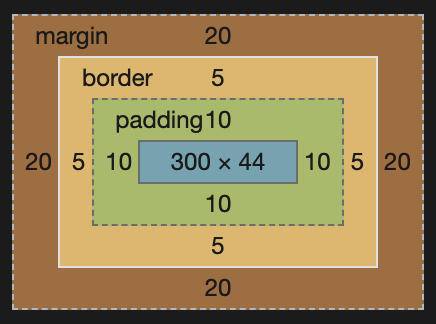
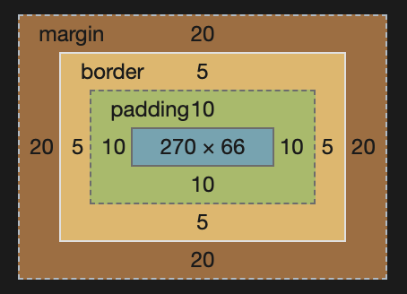

# css

## BFC 块格式化上下文

## 优先级和继承

### 优先级

`!important > 内联 > #id > .calss > element`

一个选择器的优先级可以说是由四个部分相加 (分量)，可以认为是个十百千 — 四位数的四个位数：

- 千位： 如果声明在 style 的属性（内联样式）则该位得一分。这样的声明没有选择器，所以它得分总是 1000。
- 百位： 选择器中包含 ID 选择器则该位得一分。
- 十位： 选择器中包含类选择器、属性选择器或者伪类则该位得一分。
- 个位： 选择器中包含元素、伪元素选择器则该位得一分。

### 继承

#### 继承的属性

- 字体类：`font font-family font-weight font-size font-style`
- 文本类：`text-indent text-align text-shadow line-height word-spacing letter-spacing text-transform direction color`
- 元素可见性：`visibility`
- 表格布局属性：`caption-side、border-collapse、border-spacing、empty-cells、table-layout`
- 列表属性：`list-style-type、list-style-image、list-style-position、list-style`
- 其他属性： `cursor`

#### 控制继承

- inherit 设置该属性会使子元素属性和父元素相同。实际上，就是 "开启继承".
- initial 设置属性值和浏览器默认样式相同。如果浏览器默认样式中未设置且该属性是自然继承的，那么会设置为 inherit 。
- unset 将属性重置为自然值，也就是如果属性是自然继承那么就是 inherit，否则和 initial 一样

#### 重设所有属性值

`all: inherit | initial | unset | revert`

#### a 标签

a 标签继承父元素样式，但是被浏览器的 a 元素的默认样式（blue，下划线）覆盖。在浏览器中，a 标签的默认样式：

- 未被访问的链接带有下划线而且是蓝色的
- 已被访问的链接带有下划线而且是紫色的
- 活动链接带有下划线而且是红色的（即 :active 状态）

## 选择器

### 参考链接

- [MDN CSS 选择器](https://developer.mozilla.org/zh-CN/docs/Learn/CSS/Building_blocks/Selectors)
- [阮一峰 CSS 选择器](http://www.ruanyifeng.com/blog/2009/03/css_selectors.html)
- [W3C CSS 选择器](https://www.w3school.com.cn/cssref/css_selectors.asp)

1. 基本选择器

   - `.class`
   - `#id`
   - `*`
   - `element`

2. 多元素组合选择器

   - `elementA,elementB`
   - `elementP elementC`后代选择器
   - `elementP>elementC`子代选择器
   - `element+element`兄弟选择器
   - `element1~element2`通用兄弟选择器即前面有 element1 元素的每个 element2 元素

3. 属性选择器

   - `[attribute]`;
   - `[attribute=value]`;
   - `[attribute~=value]` 选择 attribute 属性包含 `value` 的所有元素。;
   - `[attribute|=value]` 选择 attribute 属性值以 `value` 开头的所有元素;
   - `[attribute^=value]` 开头;
   - `[attribute\$=value]` 结尾;
   - `[attribute\*=value]` 包含;

4. 伪类和伪元素

伪类

    - :active :hover :focus :focus-visible :focus-within :link :visited :target
    - :disabled :enabled :empty :blank :checked :default[默认值] :required :indeterminate :in-range :valid :invalid :optional
    - :root
    - :first-child / :last-child 匹配兄弟元素中的第一个/最末元素。
    - :first-of-type / :last-of-type 匹配兄弟元素中第一个/最末某种类型的元素。
    - :nth-child :nth-of-type
    - :nth-last-child :nth-last-of-type
    - :only-child :only-of-type
    - :not

伪元素

    - ::after ::before
    - ::first-letter ::first-line
    - ::selection

> 伪类和伪元素的区别?
> 伪类：用于选择处于特定状态的元素，伪类开头为冒号:，如 :first-child :hover
> 伪元素：像在标记文本中加入全新的 HTML 元素一样，而不是向现有的元素上应用类 。伪元素开头为双冒号::，如::first-line ，特殊的如::before ::after 和 content 属性一起使用，一般用于插入图标

## 盒模型

```
width: 300px;
border: 5px solid green;
padding: 10px;
margin: 20px;
```

标准盒模型，设置宽度为 300px，即表示内容宽度为 300px，不包含 padding 和 border 。在谷歌浏览器默认为 content-box;在 IE 浏览器默认为 border-box;

- css 设置 box-sizing: content-box;



- css 设置 box-sizing: border-box;



## 布局

- 正常布局流
- display 属性
- 弹性盒子：创建横向或是纵向的一维页面布局
- 网格：用于同时在两个维度上把元素按行和列排列整齐。
- 浮动
- 定位
- CSS 表格布局
- 多列布局

## css 单位

### 相对长度单位

- rem: 根元素 html 的字体大小
- em: 在 font-size 中使用的是相对于父元素的字体大小，在其他属性中使用是相对于自身的字体大小
- vw: 视窗宽度的 1%
- vh: 视窗高度的 1%
- vmin: 视窗较小尺寸的 1%
- vmax: 视图大尺寸的 1%
- lh: 元素的 line-height
- ch: 数字“0”的宽度
- ex: 字符“x”的高度

### 绝对长度单位

- px: 像素
- pt: 点
- pc: 十二点活字
- in: 英寸
- Q: 四分之一毫米
- mm: 毫米
- cm: 厘米

## 垂直居中

### gird

```
dispaly: gird;
place-items: center;
```

或者

```
.root {
  width: 500px;
  height: 500px;
  background-color: #0ff;
  display: grid;
}
.main {
  width: 200px;
  height: 200px;
  background-color: #f00;
  align-self: center;
  justify-self: center;
}
```

或

```
.root {
  width: 500px;
  height: 500px;
  background-color: #0ff;
  display: grid;
}
.main {
  width: 200px;
  height: 200px;
  background-color: #f00;
  margin: auto;
}
```

### flex

```
display: flex;
align-items: center;
justify-content: center;
```

另一种方式

```
.root {
  width: 500px;
  height: 500px;
  background-color: #0ff;
  display: flex;
}
.main {
  width: 200px;
  height: 200px;
  margin: auto;
  background-color: #f00;
}
```

### 相对布局

```
.root {
  width: 500px;
  height: 500px;
  background-color: #0ff;
  position: relative;
}
.main {
  width: 200px;
  height: 200px;
  background-color: #f00;
  position: absolute;
  left: 50%;
  top: 50%;
  transform: translate(-50%, -50%);
}
```

或

> 使用了 CSS 中的定位属性（absolute、fixed 等）后，如果 left 设置了具体值，没有设置 right 和 width，那么就会自动计算，把剩余的空间分配给 right 和 width。如果 left、right 和 width 都设置了具体值，并且没有占满横向空间，那么剩余空间就处于待分配状态，此时设置 margin: auto; 意味着把剩余的空间分配给 margin，并且左右均分，所以就实现了水平居中，垂直方向同理。缺点：需要固定居中元素的宽高，否则其宽高会被设为 100%（副作用)

```
.root {
  width: 500px;
  height: 500px;
  background-color: #0ff;
  position: relative;
}
.main {
  width: 200px;
  height: 200px;
  background-color: #f00;
  position: absolute;
  left: 0;
  top: 0;
  right: 0;
  bottom: 0;
  margin: auto;
}
```

### table 布局

```
.root {
  width: 500px;
  height: 500px;
  display: table-cell;
  vertical-align: middle;
  text-align: center;
}
.main {
  display: inline-block; // 必须设置为 inline-block
  width: 200px;
  height: 200px;
  background-color: #f00;
}
```

## flex 布局

> 设为 Flex 布局以后，子元素的 float、clear 和 vertical-align 属性将失效。

### 容器属性

#### flex-direction

主轴的方向

- row
- row-reverse
- column
- column-reverse

#### flex-wrap

换行

- nowrap
- wrap
- wrap-reverse

#### flex-flow

flex-direction 和 flex-wrap 的简写，默认为 row nowrap

#### justify-content

水平方向对齐方式

- flex-start
- flex-end
- center
- space-between 两端对齐，项目之间的间隔都相等。
- space-around 每个项目两侧的间隔相等。所以，项目之间的间隔比项目与边框的间隔大一倍

#### align-items

垂直方向对齐

- flex-start
- flex-end
- center
- baseline 项目的第一行文字的基线对齐。
- stretch 如果项目未设置高度或设为 auto，将占满整个容器的高度。

#### align-content

多根轴线的对齐方式

- flex-start：与交叉轴的起点对齐。
- flex-end：与交叉轴的终点对齐。
- center：与交叉轴的中点对齐。
- space-between：与交叉轴两端对齐，轴线之间的间隔平均分布。
- space-around：每根轴线两侧的间隔都相等。所以，轴线之间的间隔比轴线与边框的间隔大一倍。
- stretch（默认值）：轴线占满整个交叉轴。

### 项目属性

#### order

定义项目的排列顺序。数值越小，排列越靠前，默认为 0。

#### flex-grow

属性定义项目的放大比例，默认为 0，即如果存在剩余空间，也不放大。

如果所有项目的 flex-grow 属性都为 1，则它们将等分剩余空间（如果有的话）。如果一个项目的 flex-grow 属性为 2，其他项目都为 1，则前者占据的剩余空间将比其他项多一倍。

#### flex-shrink

属性定义了项目的缩小比例，默认为 1，即如果空间不足，该项目将缩小。

如果所有项目的 flex-shrink 属性都为 1，当空间不足时，都将等比例缩小。如果一个项目的 flex-shrink 属性为 0，其他项目都为 1，则空间不足时，前者不缩小。

#### flex-basis

定义了在分配多余空间之前，项目占据的主轴空间（main size）。浏览器根据这个属性，计算主轴是否有多余空间。它的默认值为 auto，即项目的本来大小。

#### flex

是 flex-grow, flex-shrink 和 flex-basis 的简写，默认值为 0 1 auto。后两个属性可选。

该属性有两个快捷值：auto (1 1 auto) 和 none (0 0 auto)。建议优先使用这个属性，而不是单独写三个分离的属性，因为浏览器会推算相关值。

#### align-self

允许单个项目有与其他项目不一样的对齐方式，可覆盖 align-items 属性。默认值为 auto，表示继承父元素的 align-items 属性，如果没有父元素，则等同于 stretch。

```
align-self: auto | flex-start | flex-end | center | baseline | stretch;
```

## gird 布局

> 注意，设为网格布局以后，容器子元素（项目）的 float、display: inline-block、display: table-cell、vertical-align 和 column-\*等设置都将失效。

```
// grid-template-columns 每列列宽；grid-template-rows 每行行高
display: grid;
grid-template-columns: 100px 100px 100px;
grid-template-rows: 100px 100px 100px;
// 或
grid-template-columns: 33.33% 33.33% 33.33%;
grid-template-rows: 33.33% 33.33% 33.33%;
// 或 repeat(重复次数，重复值)
grid-template-columns: repeat(3, 33.33%);
grid-template-rows: repeat(3, 33.33%);

# 每列宽度100px，然后自动填充
grid-template-columns: repeat(auto-fill, 100px);
# 两个相同宽度的列
grid-template-columns: 1fr 1fr;
# minmax()函数产生一个长度范围，表示长度就在这个范围之中。它接受两个参数，分别为最小值和最大值。
grid-template-columns: 1fr 1fr minmax(100px, 1fr);
# auto关键字表示由浏览器自己决定长度
grid-template-columns: 100px auto 100px;
```

## 模块化 CSS

### BEM

[官网](http://getbem.com/)

BEM 即分为以下三部分

- Block：具有独立意义的独立实体。如：header, container, menu, checkbox, input
- Element：块的一部分，没有独立的含义，并且在语义上与该块相关。如： menu item, list item, checkbox caption, header title
- Modifier：块或元素上的标志，使用它们可以更改外观或行为。如：disabled, highlighted, checked, fixed, size big, color yellow

命名规则

```
.block {}
.block__element {}
.block--modifier {}
# 如：
.button
.button__icon
.button--danger .button--success
```

- [OOCSS](http://oocss.org/)
- [SMACSS](http://smacss.com/)
- [SUITCSS](http://suitcss.github.io/)
- [ATOMIC](https://github.com/nemophrost/atomic-css)

### CSS Modules

- [css-modules github](https://github.com/css-modules/css-modules)
- [阮一峰老师教程](http://www.ruanyifeng.com/blog/2016/06/css_modules.html)

在 `webpack.config.js` 下使用 CSS Modules。更多可参考 [webpack-demo](https://github.com/css-modules/webpack-demo)

```
{
  test: /\.css$/,
  loader: 'style!css-loader?modules'
}
```
