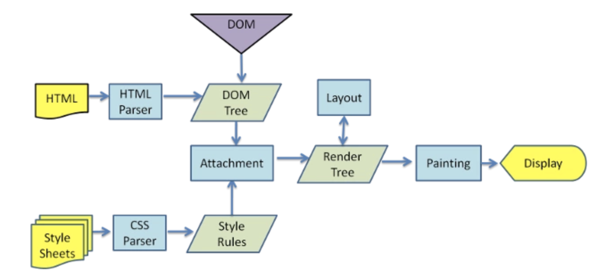

# 浏览器

## 参考链接

[MDN 浏览器的工作原理](https://developer.mozilla.org/zh-CN/docs/Web/Performance/%E6%B5%8F%E8%A7%88%E5%99%A8%E6%B8%B2%E6%9F%93%E9%A1%B5%E9%9D%A2%E7%9A%84%E5%B7%A5%E4%BD%9C%E5%8E%9F%E7%90%86)

## 用户通过在地址栏输入一个 URL 后发生了什么

1. 通过 DNS 服务器查找对应的 ip；
2. 浏览器通过 TCP “三次握手”与服务器建立连接（SYN->SYN+ACK->ACK）

   - 第一次握手：建立连接。客户端发送连接请求报文段，将 SYN 位置为 1，Sequence Number 为 x；然后，客户端进入 SYN_SEND 状态，等待服务器的确认；
   - 第二次握手：服务器收到 SYN 报文段。服务器收到客户端的 SYN 报文段，需要对这个 SYN 报文段进行确认，设置 Acknowledgment Number 为 x+1(Sequence Number+1)；同时，自己自己还要发送 SYN 请求信息，将 SYN 位置为 1，Sequence Number 为 y；服务器端将上述所有信息放到一个报文段（即 SYN+ACK 报文段）中，一并发送给客户端，此时服务器进入 SYN_RECV 状态；
   - 第三次握手：客户端收到服务器的 SYN+ACK 报文段。然后将 Acknowledgment Number 设置为 y+1，向服务器发送 ACK 报文段，这个报文段发送完毕以后，客户端和服务器端都进入 ESTABLISHED 状态，完成 TCP 三次握手。

3. 如果是 https 请求，还需要进行 TLS 协商
4. 浏览器向服务器发送请求
5. 浏览器处理请求并返回响应
6. 浏览器解析渲染页面

## 浏览器渲染



1. 解析 html，生成 DOM 树；解析 css，生成 CSSOM 树
2. 将 CSSOM 树和 DOM 树结合，生成渲染树 Render Tree
3. Layout 布局：根据渲染树进行回流，得到节点的几何信息（位置、大小）
4. Painting 绘制：根据渲染树和回流得到的几何信息，得到节点的绝对像素
5. Display 将像素发给 GPU，展示在页面上

### 生成渲染树

1. 从 DOM 树的根节点开始遍历每个可见节点。
2. 对于每个可见的节点，找到 CSSOM 树中对应的规则，并应用它们。
3. 根据每个可见节点以及其对应的样式，组合生成渲染树。

#### 不可见节点

- 一些不会渲染输出的节点，如 link、script、meta 等
- 一些通过 css 隐藏的节点，如 display: none；

## 回流和重绘

### 回流

元素的大小或位置发生了变化，触发了重新布局，导致渲染树重新计算布局和渲染

如添加或删除可见的 dom；元素位置发生变化；元素的尺寸发生变化（margin、padding、border、width、height）；内容发生变化；页面一开始渲染的时候；浏览器窗口尺寸变化

### 重绘

元素样式的改变，但宽高、大小、位置 不变。

```
outline,visibility,color,background-color等
```

回流一定会触发重绘，重绘不一定会回流。

## 优化

- 减少 http 请求
  - 合并压缩(雪碧图，图片懒加载)
- 减少 DOM 重绘和回流
  - 放弃传统操作 dom 的时代，使用 vue 和 React 开始数据影响视图模式。如：MVVM、MVC、virtual dom、dom diff。
  - 样式集中改变：合并多次对 DOM 和样式的修改，通过设置 class 或设置 cssText 拼接起来
  - 分离读写（由于每次回流会造成额外的计算消耗，现代的大多数浏览器会通过队列化修改并批量执行来优化重排过程。浏览器会将修改操作放到队列里，直到过了一段时间，或者操作达到了一个阀值，才清空队列。但是，当获取布局信息操作的时候，如：offsetTop ,...,clientTop,...，scrollTop,...，getComputedStyle，currentStyle 等会强制队列刷新。）
  - 缓存布局信息： 如设置`div.style.left = div.offsetLeft + 10 + "px";` 改为`div.style.left = offsetLeft + 10 + "px";`
