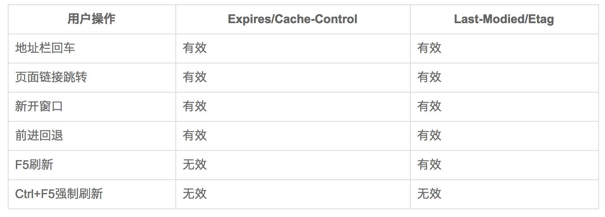

# http

## http 各版本

### HTTP/0.9

1. 只支持 GET 请求，不能传输数据包
2. 服务器只能回应 HTML 格式的字符串，不能回应别的格式。
3. 服务器发送完毕，就关闭 TCP 连接。

### HTTP/1.0

1. 支持发送任何格式的内容。如文字、图像、视频、二进制文件等。
2. 支持 GET POST HEAD
3. 请求和回应格式都必须包括头信息（HTTP header），用来描述一些元数据
4. 新增状态码（status code）、多字符集支持、多部分发送（multi-part type）、权限（authorization）、缓存（cache）、内容编码（content encoding）等。

- 缺点：
  每个 TCP 连接只能发送一个请求，连接就关闭了，如果还要请求其他资源，就必须再新建一个连接。可以通过设置非标准字段`Connection: keep-alive`，进行请求复用。

### HTTP/1.1

1. 持久连接
   最大的变化是持久连接，即 TCP 连接默认不关闭，可以被多个请求复用，不用声明`Connection: keep-alive`。客户端和服务器发现对方一段时间没有活动，就可以主动关闭连接。不过，规范的做法是，客户端在最后一个请求时，发送`Connection: close`，明确要求服务器关闭 TCP 连接。目前，对于同一个域名，大多数浏览器允许同时建立 6 个持久连接。

2. 管道机制
   在同一个 TCP 连接里面，客户端可以同时发送多个请求。这样就进一步改进了 HTTP 协议的效率。

3. Content-Length
   一个 TCP 连接现在可以传送多个回应，势必就要有一种机制，区分数据包是属于哪一个回应的。这就是 Content-length 字段的作用，声明本次回应的数据长度。

4. 分块传输编码
   使用 Content-Length 字段的前提条件是，服务器发送回应之前，必须知道回应的数据长度。
   对于一些很耗时的动态操作来说，这意味着，服务器要等到所有操作完成，才能发送数据，显然这样的效率不高。更好的处理方法是，产生一块数据，就发送一块，采用"流模式"（stream）取代"缓存模式"（buffer）。
   因此，1.1 版规定可以不使用 Content-Length 字段，而使用"分块传输编码"（chunked transfer encoding）。只要请求或回应的头信息有 Transfer-Encoding 字段，就表明回应将由数量未定的数据块组成。
5. Method 新增 PUT、PATCH、HEAD、 OPTIONS、DELETE
6. 客户端请求的头信息新增了 Host 字段，用来指定服务器的域名

缺点

虽然 1.1 版允许复用 TCP 连接，但是同一个 TCP 连接里面，所有的数据通信是按次序进行的。服务器只有处理完一个回应，才会进行下一个回应。要是前面的回应特别慢，后面就会有许多请求排队等着。这称为"队头堵塞"。

为了避免这个问题，只有两种方法：一是减少请求数，二是同时多开持久连接。这导致了很多的网页优化技巧，比如合并脚本和样式表、将图片嵌入 CSS 代码、域名分片（domain sharding）等等。如果 HTTP 协议设计得更好一些，这些额外的工作是可以避免的。

### HTTP/2

1. 二进制协议
   HTTP1.1 头信息是文本，数据体可以是文本，也可以是二进制。HTTP2 头信息和数据体都是二进制，并且统称为帧：头信息帧和数据帧。好处是可以定义额外的帧。
2. 多工 （双向-实时）
   复用 TCP 连接，在一个连接里，可以同时发送多个请求或响应，而且不用按照顺序一一对应，避免了队头阻塞。

3. 数据流
   因为 HTTP/2 的数据包是不按顺序发送的，同一个连接里面连续的数据包，可能属于不同的回应。因此，必须要对数据包做标记，指出它属于哪个回应。

   HTTP/2 将每个请求或回应的所有数据包，称为一个数据流（stream）。每个数据流都有一个独一无二的编号。数据包发送的时候，都必须标记数据流 ID，用来区分它属于哪个数据流。另外还规定，客户端发出的数据流，ID 一律为奇数，服务器发出的，ID 为偶数。

   数据流发送到一半的时候，客户端和服务器都可以发送信号（RST_STREAM 帧），取消这个数据流。1.1 版取消数据流的唯一方法，就是关闭 TCP 连接。这就是说，HTTP/2 可以取消某一次请求，同时保证 TCP 连接还打开着，可以被其他请求使用。

   客户端还可以指定数据流的优先级。优先级越高，服务器就会越早回应。

4. 头信息压缩
   http 协议无状态，每次请求都必须附上所有信息，导致请求字段有重复，浪费贷款，影响速度。在 HTTP2 中使用 gzip 或 compress 压缩后在发送；另一方面，客户端和服务器同时维护一张头信息表，所有字段都会存入这张表，生成一个索引号，之后请求不发送同样字段，只发送索引号，提高速度。
5. 服务器推送
   允许服务器未经请求，主动向客户端发送资源

### 总结

- HTTP/0.9 只支持 GET 请求；服务器只能返回 html 格式的字符串；服务器发送完毕就关闭连接。
- HTTP/1.0 支持 GET POST HEAD 请求；每个 TCP 连接只能发送一个请求。
- HTTP/1.1 持久连接（限制 6 个）；管道机制；Content-Length；分块传输；新增 PUT、PATCH、HEAD、 OPTIONS、DELETE；HEAD 中新增 Host； 队头堵塞。
- HTTP/2 二进制协议；多工；数据流；头信息压缩；服务器推送；

## 请求方式

- GET
- POST
- PUT
- DELETE
- OPTIONS
- HEAD: 与 get 类似，只不过返回的响应中没有具体的内容，用于获取报头
- PATCH: 是 put 的补充,局部更新
- Trace: 回显服务器收到的请求，主要用于测试或诊断
- CONNECT: http1.1 中预留给能够将连接方式改为管道方式的代理服务器

## 跨域

### jsonp

原理：利用 script（或 img，iframe） 标签中的 src 属性没有同源策源的限制，前端将回调函数作为参数传给服务器，服务器注入参数后返回；

缺点：只能用于 get 请求；安全性低；

```
const script = document.createElement("script");
script.type = "text/javascript";
script.src = "http://www.baidu.com?callback=callback";
function callback() {
  console.log("callback");
}
document.head.appendChild(script);
```

### nginx 反向代理

```
server {
  listen       3000;
  server_name  localhost;

  location /api/ {
      proxy_pass  http://localhhost:3010;
  }

  location / {
      root   html;
      index  index.html index.htm;
  }
}
```

### node Server 代理

proxy 工作原理实质上是利用 http-proxy-middleware 这个 http 代理中间件，实现请求转发给其他服务器。例如：本地主机 A 为<<http://localhost:3000，该主机浏览器发送一个请求，接口为/api，这个请求的数据（响应）在另外一台服务器B> <http://10.231.133.22:80上，这时，就可以通过A主机设置webpack>> proxy，直接将请求发送给 B 主机。

原理：通过代理服务器，实现转发

```
const express = require('express');
const { createProxyMiddleware } = require('http-proxy-middleware');

const app = express();

app.use('/api', createProxyMiddleware({ target: 'http://www.example.org', changeOrigin: true }));
app.listen(3000);

// http://localhost:3000/api/foo/bar -> http://www.example.org/api/foo/bar
```

### cros

详细请看[阮一峰 跨域资源共享 CORS 详解](https://www.ruanyifeng.com/blog/2016/04/cors.html)

原理：根据服务器返回响应头中是否包含`Access-Control-Allow-Origin`。

缺点：需要浏览器和服务器同时支持

- 简单请求

请求方式是`Get，Head，Post`，请求头不超过以下字段
Accept
Accept-Language
Content-Language
Last-Event-ID
Content-Type：只限于三个值 application/x-www-form-urlencoded、multipart/form-data、text/plain

- 非简单请求

非简单请求是那种对服务器有特殊要求的请求，比如请求方法是 PUT 或 DELETE，或者 Content-Type 字段的类型是 application/json。非简单请求的 CORS 请求，会在正式通信之前，增加一次 HTTP 查询请求，称为"预检"请求（preflight）。

浏览器先询问服务器，当前网页所在的域名是否在服务器的许可名单之中，以及可以使用哪些 HTTP 动词和头信息字段。只有得到肯定答复，浏览器才会发出正式的 XMLHttpRequest 请求，否则就报错。

> CORS 请求默认不发送 Cookie 和 HTTP 认证信息。如果要把 Cookie 发到服务器，一方面要服务器同意，指定 Access-Control-Allow-Credentials 字段。另一方面，开发者必须在 AJAX 请求中打开 withCredentials 属性。
> 需要注意的是，如果要发送 Cookie，Access-Control-Allow-Origin 就不能设为星号，必须指定明确的、与请求网页一致的域名。同时，Cookie 依然遵循同源政策，只有用服务器域名设置的 Cookie 才会上传，其他域名的 Cookie 并不会上传，且（跨源）原网页代码中的 document.cookie 也无法读取服务器域名下的 Cookie。

### 利用 iframe 实现跨域

详细可查看[前端常见跨域解决方案（全）
](https://segmentfault.com/a/1190000011145364)

## 缓存

### 缓存的优点

- 减少冗余数据传输
- 减少服务器负担，提升网站性能
- 加快客户端加载网页速度

浏览器在第一次请求发生后，再次请求时：

1. 浏览器会先获取该资源缓存的 header 信息，根据其中的 Expires 和 Cache-Control 判断是否命中强缓存，若命中则直接从缓存中获取资源，包括缓存的 header 信息，本次请求不会与服务器进行通信。
2. 如果没有命中强缓存，浏览器会发送请求到服务器，该请求会携带第一次请求返回的有关缓存的 header 字段信息（Last-Modified/IF-Modified-Since、Etag/IF-None-Match），由服务器根据请求中的 header 字段信息来对比结果是否命中协商缓存，若命中，则服务器返回新的响应 header 信息，但是并不返回资源内容，它会告知浏览器可以直接从缓存获取；否则返回最新的资源内容。

### 强缓存

强缓存是利用 http 的返回头中的 Expires 或者 Cache-Control 两个字段来控制的，用来表示资源的缓存时间。

#### Expires

Expires 是 http1.0 时的规范，它的值为一个绝对时间的 GMT 格式的时间字符串，比如 Expires:Mon,18 Oct 2066 23:59:59 GMT。这个时间代表着这个资源的失效时间，在此时间之前，即命中缓存。这种方式有一个明显的缺点，由于失效时间是一个绝对时间，所以当服务器与客户端时间偏差较大时，就会导致缓存混乱。

#### Cache-Control

Cache-Control 是 http1.1 时出现的 header 信息，主要是利用该字段的 max-age 值来进行判断，它是一个相对时间，例如 Cache-Control:max-age=3600，代表着资源的有效期是 3600 秒。cache-control 除了该字段外，还有下面几个比较常用的设置值：

no-cache：不使用本地缓存。需要使用缓存协商，先与服务器确认返回的响应是否被更改，如果之前的响应中存在 ETag，那么请求的时候会与服务端验证，如果资源未被更改，则可以避免重新下载。
no-store：直接禁止游览器缓存数据，每次用户请求该资源，都会向服务器发送一个请求，每次都会下载完整的资源。
public：可以被所有的用户缓存，包括终端用户和 CDN 等中间代理服务器。
private：只能被终端用户的浏览器缓存，不允许 CDN 等中继缓存服务器对其缓存。

Cache-Control 与 Expires 可以在服务端配置同时启用，同时启用的时候 Cache-Control 优先级高。

### 协商缓存

协商缓存就是由服务器来确定缓存资源是否可用，所以客户端与服务器端要通过某种标识来进行通信，从而让服务器判断请求资源是否可以缓存访问，这主要涉及到下面两组 header 字段，这两组搭档都是成对出现的，即第一次请求的响应头带上某个字段（Last-Modified 或者 Etag），则后续请求则会带上对应的请求字段（If-Modified-Since 或者 If-None-Match），若响应头没有 Last-Modified 或者 Etag 字段，则请求头也不会有对应的字段。

#### Last-Modify/If-Modify-Since

浏览器第一次请求一个资源的时候，服务器返回的 header 中会加上 Last-Modify，Last-modify 是一个标识该资源的最后修改时间，例如 Last-Modify: Thu,31 Dec 2037 23:59:59 GMT。

当浏览器再次请求该资源时，request 的请求头中会包含 If-Modify-Since，该值为缓存之前返回的 Last-Modify。服务器收到 If-Modify-Since 后，根据资源的最后修改时间判断是否命中缓存。

如果命中缓存，则返回 304，并且不会返回资源内容，并且不会返回 Last-Modify。

#### ETag/If-None-Match

与 Last-Modify/If-Modify-Since 不同的是，Etag/If-None-Match 返回的是一个校验码。ETag 可以保证每一个资源是唯一的，资源变化都会导致 ETag 变化。服务器根据浏览器上送的 If-None-Match 值来判断是否命中缓存。

与 Last-Modified 不一样的是，当服务器返回 304 Not Modified 的响应时，由于 ETag 重新生成过，response header 中还会把这个 ETag 返回，即使这个 ETag 跟之前的没有变化。

#### 为什么要有 Etag

HTTP1.1 中 Etag 的出现主要是为了解决几个 Last-Modified 比较难解决的问题：

- 一些文件也许会周期性的更改，但是他的内容并不改变(仅仅改变的修改时间)，这个时候我们并不希望客户端认为这个文件被修改了，而重新 GET；
- 某些文件修改非常频繁，比如在秒以下的时间内进行修改，(比方说 1s 内修改了 N 次)，If-Modified-Since 能检查到的粒度是 s 级的，这种修改无法判断(或者说 UNIX 记录 MTIME 只能精确到秒)；
- 某些服务器不能精确的得到文件的最后修改时间。

Last-Modified 与 ETag 是可以一起使用的，服务器会优先验证 ETag，一致的情况下，才会继续比对 Last-Modified，最后才决定是否返回 304。

### 总结

| 缓存类型 | 获取资源形式 | 状态码 | 发送请求到服务器                 |
| -------- | ------------ | ------ | -------------------------------- |
| 强缓存   | 从缓存取     | 200    | 否，直接从缓存取                 |
| 协商缓存 | 从缓存取     | 304    | 否，通过服务器来告知缓存是否可用 |

### 用户行为对缓存的影响



地址栏回车、页面链接跳转、新开窗口、前进后退的时候缓存仍然有效；

F5 刷新的时候，强缓存无效，协商缓存有效；

Ctrl+F5 强制刷新，两者都无效。

## https

### 为什么需要加密

因为 http 的内容是明文传输的，明文数据会经过中间代理服务器、路由器、wifi 热点、通信服务运营商等多个物理节点，如果信息在传输过程中被劫持，传输的内容就完全暴露了，他还可以篡改传输的信息且不被双方察觉，这就是中间人攻击。

### 加密演进

#### 对称加密

特点：通信双方各自持有同一个密钥，且没有别人知道；
问题：密钥如何保证传输的双方知晓，且不被别人知道。若服务器生成密钥，传输给浏览器，也会被别人劫持。如果浏览器预存网站 A 的密钥，但是无法预存所有网站的密钥。

#### 非对称加密

特点：一把公钥和一把私钥，用公钥加密的内容必须用私钥才能解开。
问题 1：服务器把公钥明文传输给浏览器，之后浏览器向服务器传数据前用公钥加密传输，但是也会有公钥被劫持的问题。
问题 2: 服务器拥有非对称密钥的公钥 A 和私钥 A1，浏览器拥有非对称密钥的公钥 B 和私钥 B1。服务器把 A 传给浏览器，浏览器把 B 传给服务器。这样会导致每次加密解密非常耗时。

#### 非对称加密+对称加密

特点：网站有非对称密钥 A 和 A1，浏览器向服务器请求，服务器把 A 传给浏览器，浏览器生成对称加密密钥 X，用 A 加密传给服务器。服务器拿到后用 A1 解密得到 X。
问题：中间人攻击。中间人劫持 A，并保存，然后将 A 换成自己伪造的 B，浏览器用 B 生成对称密钥 X，中间人劫持用 B1 解密拿到 X，在用 A 加密传给服务器。

这样的话浏览器无法确认自己收到的公钥是不是网站自己的。

#### 数字证书

网站在使用 HTTPS 前，需要向“CA 机构”申请颁发一份数字证书，数字证书里包含：证书持有者、证书持有者的公钥等信息。服务器把证书传输给浏览器，浏览器从证书里取公钥就行了，证书就如身份证一样，可以证明“该公钥对应该网站”。

数字证书如何防止被篡改？-- 数字签名

**什么是数字签名**

把证书内容生成一份“签名”，比对证书内容和签名是否一致就能察觉是否被篡改。这种技术就叫数字签名。

数字签名的制作过程：

- CA 拥有非对称加密的私钥和公钥。
- CA 对证书明文信息进行 hash。
- 对 hash 后的值用私钥加密，得到数字签名。

浏览器验证过程：

- 拿到证书，得到明文 T，数字签名 S。
- 用 CA 机构的公钥对 S 解密（由于是浏览器信任的机构，所以浏览器保有它的公钥。详情见下文），得到 S’。
- 用证书里说明的 hash 算法对明文 T 进行 hash 得到 T’。
- 比较 S’是否等于 T’，等于则表明证书可信。

### HTTPS 必须在每次请求中都要先在 SSL/TLS 层进行握手传输密钥吗

服务器会为每个浏览器（或客户端软件）维护一个 session ID，在 TLS 握手阶段传给浏览器，浏览器生成好密钥传给服务器后，服务器会把该密钥存到相应的 session ID 下，之后浏览器每次请求都会携带 session ID，服务器会根据 session ID 找到相应的密钥并进行解密加密操作，这样就不必要每次重新制作、传输密钥了！
