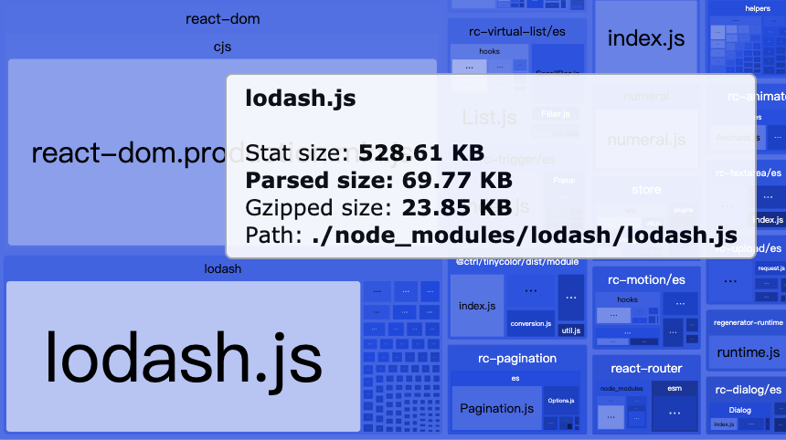
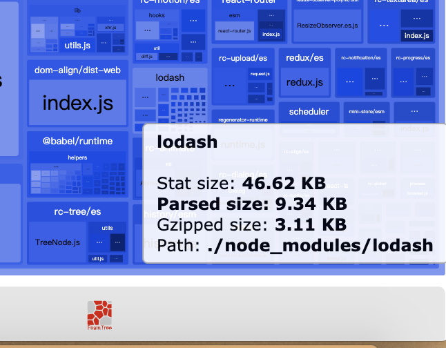
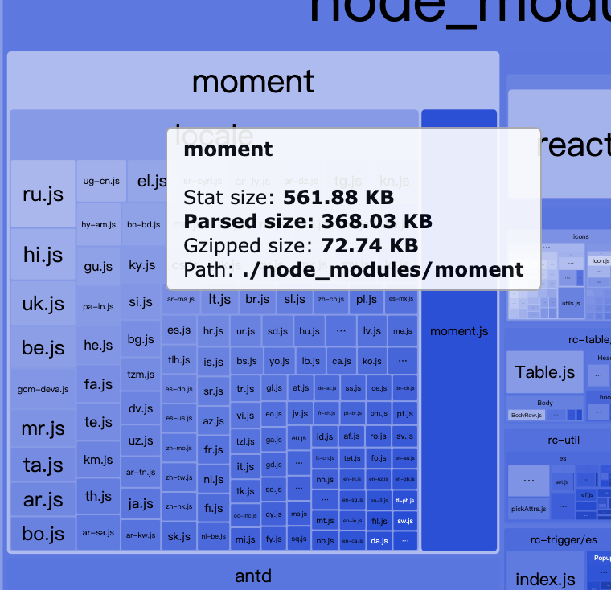
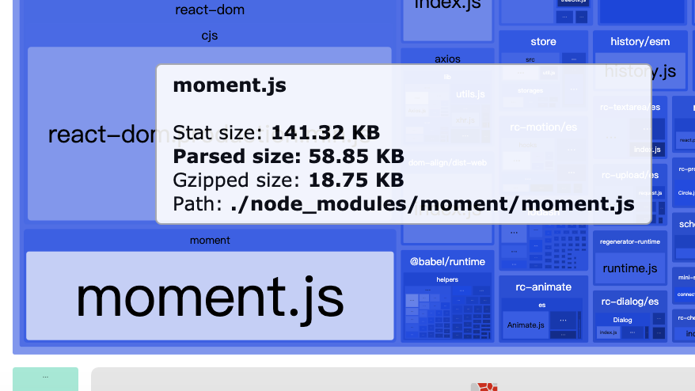

# Webpack

## 常用的 loaders

- css 相关：style-loader css-loader postcss-loader sass-loader less-loader style-resources-loader
- 图片、资源类：url-loader @svgr/webpack
- js 类：babel-loader
- file-loader

## 常用的 plugin

- HtmlWebpackPlugin
- BundleAnalyzerPlugin
- LodashModuleReplacementPlugin
- MiniCssExtractPlugin
- WorkboxWebpackPlugin
- ForkTsCheckerWebpackPlugin
- ESLintPlugin
- optimization.splitChunks （4之前用CommonsChunkPlugin）

## BundleAnalyzerPlugin

```
const BundleAnalyzerPlugin = require('webpack-bundle-analyzer')
  .BundleAnalyzerPlugin;
module.exports = {
  'plugins': [
    new BundleAnalyzerPlugin(),
  ]
};
```

分析包的体积

## 配置lodash 按需加载





```
yarn add lodash
yarn add lodash-webpack-plugin babel-loader babel-plugin-lodash @babel/core @babel/preset-env @babel/cli
```

在 `webpack.config.js` 中配置

```
const LodashModuleReplacementPlugin = require('lodash-webpack-plugin');

module.exports = {
  'module': {
    'rules': [{
      'use': 'babel-loader',
      'test': /\.js$/,
      'exclude': /node_modules/,
      'options': {
        'plugins': ['lodash'],
        presets: [["@babel/env", { targets: { node: 6 } }]],
      }
    }]
  },
  'plugins': [
    new LodashModuleReplacementPlugin,
  ]
};
```

## 配置moment




### 使用 IgnorePlugin

在 `webpack.config.js` 中配置

```
module.exports = {
  plugins: [
    // 在打包时排除moment中所有的locale下的文件
    new webpack.IgnorePlugin(/^\.\/locale$/, /moment$/),
  ],
```

### 使用 moment-locales-webpack-plugin

```
yarn add -D moment-locales-webpack-plugin
```

在 `webpack.config.js` 中配置

```
const MomentLocalesPlugin = require('moment-locales-webpack-plugin');

module.exports = {
  plugins: [
    new MomentLocalesPlugin(),
    // 或
    // new MomentLocalesPlugin({
    //   localesToKeep: ["zh-cn"],
    // }),
  ],
};
```
